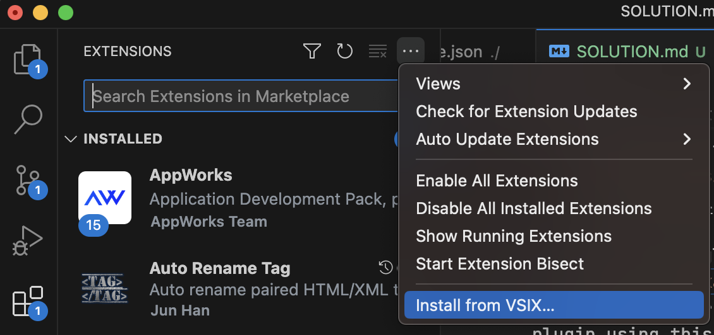

1. check if you are under project root directory:
run `ls`, if you can see `SOLUTION.md`, you are in project root directory.

2. install the dependencies with `npm i`

3. make sure that you have `wasm-pack` command,
if you don't have it, please install it by `cargo install wasm-pack`;
    > if you don't have `cargo`, please visit the [Rust official website](https://www.rust-lang.org/zh-CN/tools/install), install it.

4. install vsce globally `npm install -g vsce`;
5. run `vsce package`, there will generate a `.vsix` file in project root directory.
6. uninstall your CodeCursor plugin,  then install by this generated `.vsix` file:
    

NOTICE:
this is just temporary solution, when CodeCursor Plugin official updates, please come back to use it.